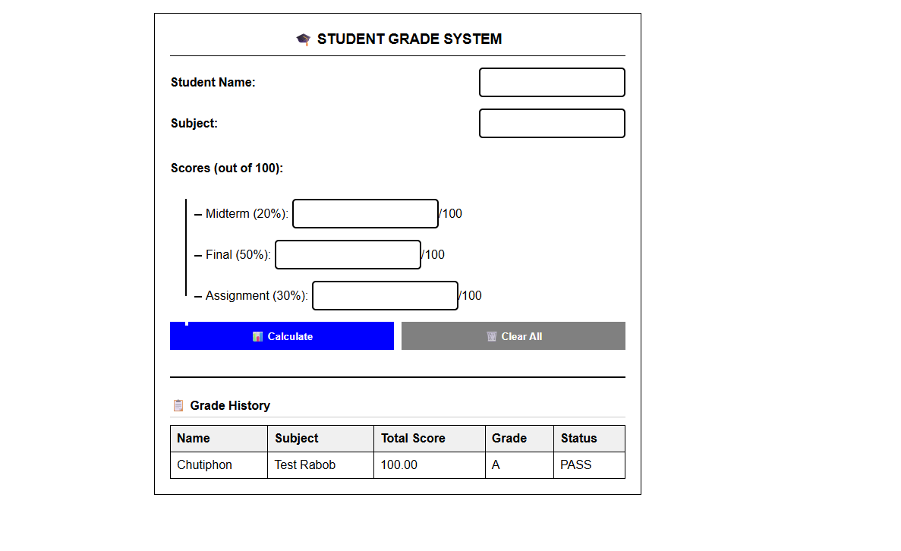

# 🎓 Student Grade System


ระบบคำนวณเกรดนักเรียนแบบง่าย  
พัฒนาโดยใช้ **HTML, CSS และ JavaScript**  
สามารถคำนวณคะแนน ตัดเกรด แสดงสถานะ PASS/FAIL และบันทึกประวัติผลลัพธ์ได้


---


## 📸 ตัวอย่างหน้าจอโปรแกรม





> ภาพตัวอย่างการทำงานของระบบคำนวณเกรด


---


## ✨ คุณสมบัติ (Features)


- กรอกชื่อผู้เรียนและรายวิชา
- รับคะแนน
  - Midterm (20%)
  - Final (50%)
  - Assignment (30%)
- ตรวจสอบความถูกต้องของข้อมูล (0–100)
- คำนวณคะแนนรวมอัตโนมัติ
- ตัดเกรด A–F
- แสดงสถานะ PASS / FAIL
- บันทึกประวัติผลการคำนวณด้วย `localStorage`
- แสดงตารางประวัติย้อนหลัง


---


## 🛠 เทคโนโลยีที่ใช้


- HTML5
- CSS3 (Flexbox)
- JavaScript (Vanilla JS)
- LocalStorage


---


## 📂 โครงสร้างโปรเจกต์


```
project-root/
│
├── index.html
├── styles.css
├── main.js
├── README.md
└── images/
    └── test.png
```

---

▶ วิธีการใช้งาน

เปิดไฟล์ index.html ด้วย Web Browser

กรอกชื่อผู้เรียนและรายวิชา

ใส่คะแนนแต่ละส่วน (0–100)

กดปุ่ม Calculate

ดูผลคะแนน เกรด และสถานะ

ประวัติผลลัพธ์จะแสดงในตารางด้านล่างอัตโนมัติ

---

👤 ผู้ทำ
Chutiphon Jitrungraungsuk 67160003

Student Project Exam